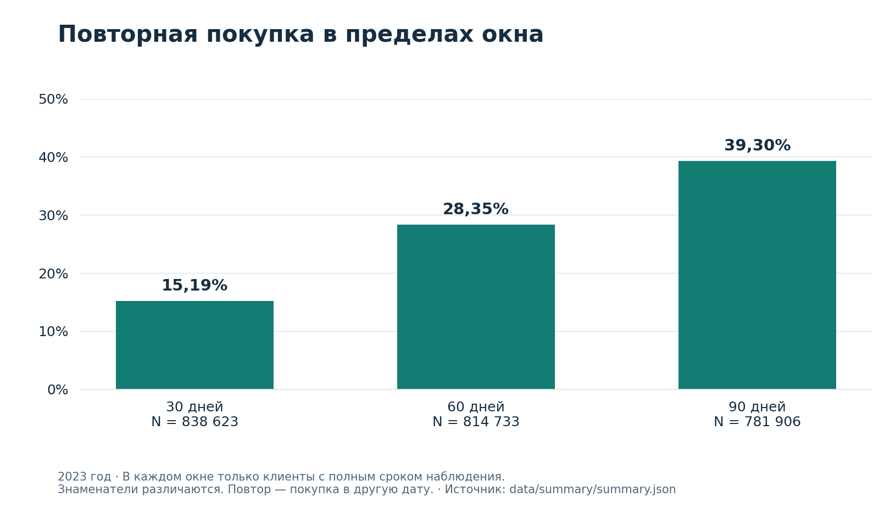
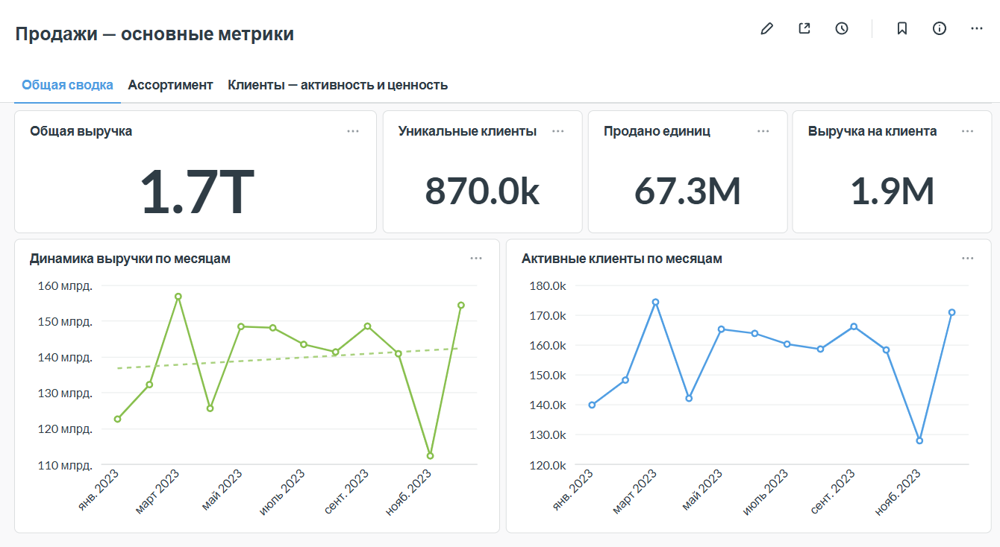

# Аналитика продаж маркетплейса

**Python · PostgreSQL · SQL · Metabase · ABC/XYZ · RFM · Когорты**

Учебный проект полного цикла: продажи из API загружаются в PostgreSQL, исследуются SQL-запросами и представляются в Metabase. Аналитический период — **2023 год**. Два исследования связывают результаты с решениями по ассортименту и клиентской базе и предлагают способы проверить их экономический эффект.

## Два аналитических исследования

| Направление | Бизнес-вопрос | Материалы |
|---|---|---|
| **Ассортимент** | Какие товары поддерживать, развивать и отправлять на ревизию? | [Читать исследование](docs/analysis/assortment.md) · [Презентация](reports/assortment/assortment-presentation.pptx) · [Отчёт](reports/assortment/assortment-report.docx) · [SQL](sql/README.md#ассортимент) |
| **Клиентская база** | Какие аудитории и механики выбирать для повторных покупок? | [Читать исследование](docs/analysis/customers.md) · [Презентация](reports/customers/customers-presentation.pptx) · [Отчёт](reports/customers/customers-report.docx) · [SQL](sql/README.md#клиентская-база) |

В каждом исследовании: **вопрос → расчёт → результат → предлагаемое действие → проверка эффекта**. Презентации содержат по 14 слайдов, подробные отчёты — по 8 страниц. Эксперименты описаны как предложения; их эффект пока не измерен.

## Ключевые результаты

- **Приоритетный ассортимент.** 21 593 товара AA — 43,19% матрицы — формируют 66,65% выручки. Это основание приоритизировать их доступность и учитывать XYZ при планировании пополнения.
- **Ценные неактивные клиенты.** 10,18% базы дали 17,68% исторической выручки. Предложена адресная реактивация с контрольной группой и оценкой дополнительной ценности после затрат.
- **Повторная активность.** За 30/60/90 дней возвращаются 15,19% / 28,35% / 39,30% клиентов с полным окном наблюдения. Знаменатели различаются. Предложен тест персональных рекомендаций после первой покупки.

Числа сохранены из предыдущего исследования; публикация не сопровождалась новым запуском на рабочей базе. [Агрегаты, источники и округления](data/summary/README.md) доступны отдельно. Новые группы ассортиментных и скидочных действий, включая 184 SKU приоритетной ревизии, пока представлены агрегатами без финальных CASE-правил. [Связь со старым отбором пяти CCZ-товаров](docs/analysis/assortment.md#почему-в-существующем-sql-пять-кандидатов) пояснена в кейсе.

## Пример результата: повторные покупки



[Клиентское исследование](docs/analysis/customers.md) раскрывает RFM, когорты и LTV. [Ассортиментный кейс](docs/analysis/assortment.md) показывает двойной ABC, XYZ, группы действий и ценовые гипотезы.

## Данные, расчёты и визуализация

API → Python-загрузка → PostgreSQL `sales` → аналитические SQL-запросы → Metabase и отчёты.

| Часть проекта | Содержание |
|---|---|
| [load.py](load.py), [daily_load.py](daily_load.py) | Историческая загрузка за 2023 год и загрузка за вчера по времени окружения |
| [sql/00_create_sales.sql](sql/00_create_sales.sql) | Схема таблицы продаж |
| [sql/assortment/](sql/assortment/) | 16 запросов: ABC, XYZ, скидки и CCZ |
| [sql/customers/](sql/customers/) | 14 запросов: профиль, RFM, retention, repeat rate, LTV и сценарии |
| [docs/analysis/](docs/analysis/) | Два аналитических кейса с выводами и программой проверки рекомендаций |
| [reports/](reports/README.md) | Четыре редактируемых файла PPTX/DOCX |
| [data/summary/](data/summary/README.md) | Исторический снимок агрегатов в JSON и CSV |
| [scripts/build_summary_assets.py](scripts/build_summary_assets.py) | Построение трёх графиков и CSV из снимка |
| [docs/dashboards.md](docs/dashboards.md) | Скриншоты и публичные ссылки Metabase |
| [deployment/cron.example](deployment/cron.example) | Пример ежедневного запуска загрузчика |

## Дашборды Metabase

[Обзор продаж](http://194.58.118.193:3000/public/dashboard/978dff62-493d-4fd6-bb8e-1ac864d4224c) · [Клиенты и ассортимент](http://194.58.118.193:3000/public/dashboard/955746b0-6571-4fc7-b266-d2311d82217a) · [Все скриншоты и пояснения](docs/dashboards.md)



Дашборды доступны без авторизации и зависят от работы VPS. Скриншоты доступны в репозитории независимо от сервера. Часть исследовательских карточек создана на зафиксированных результатах `VALUES` и не пересчитывается после загрузки новых продаж. [Условия просмотра](docs/dashboards.md#условия-просмотра).

## Методика и границы выводов

- Выборка: `quantity > 0`, период `[2023-01-01, 2024-01-01)`.
- Двойной ABC: отдельно по выручке и количеству единиц, накопленные границы 80% / 95%.
- XYZ: CV ≤ 55% — X; 55% < CV ≤ 75% — Y; CV > 75% — Z. Месяцы без продаж включены с нулём.
- RFM: дата расчёта 01.01.2024; частота — уникальные покупательские дни.
- LTV M0–M6: накопленная выручка на исходного клиента фиксированных когорт января–июня, включая месяц M0.
- Repeat rate: покупка в другую дату в течение 30, 60 или 90 дней; отдельный полный горизонт для каждого окна.

Без `order_id` дни нельзя приравнивать к заказам. Без себестоимости и остатков нельзя оценить прибыль и дефицит. Сценарный эффект retention не является прогнозом или доказанным эффектом CRM. Денежные суммы сохранены в масштабе учебного источника. [Полная методология](docs/methodology.md).

## Запуск и воспроизведение

Нужны Python, доступ к API и существующая PostgreSQL-база с таблицей `sales`.

```bash
git clone https://github.com/hiakomi/marketplace-sales-analytics.git
cd marketplace-sales-analytics
python -m venv .venv
```

Активируйте окружение, установите `requirements.txt` и задайте `DB_HOST`, `DB_PORT`, `DB_NAME`, `DB_USER`, `DB_PASSWORD`. Скрипты **не читают `.env` автоматически**. Команды для Linux/macOS и Windows находятся в [инструкции запуска](docs/setup.md).

```bash
# Историческая загрузка за 2023 год
python load.py
# Данные за вчера
python daily_load.py
```

Загрузчик заменяет непустую дневную выгрузку через `DELETE` и пакетный `INSERT` в одной транзакции с откатом при ошибке. Пустой ответ пропускается, прежние данные остаются. Конкурирующие загрузки одной даты не защищены. `total_price` приходит из API и приводится к `float`, без пересчёта денежной формулы загрузчиком.

Запросы из [каталога SQL](sql/README.md) выполняются по отдельности в DBeaver или Metabase. База продаж и рабочие реквизиты в репозиторий не входят.

Для построения опубликованных графиков и CSV база не нужна:

```bash
python -m pip install -r requirements-visuals.txt
python scripts/build_summary_assets.py
```

Скрипт использует сохранённый JSON, поэтому эта команда воспроизводит визуализации, а не пересчитывает исследование.

[История подготовки и проверок](docs/preparation-notes.md) · [Методология](docs/methodology.md) · [Каталог файлов отчётов](reports/README.md)
