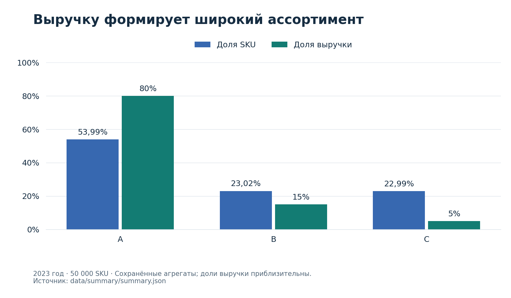

# Ассортимент: от ABC/XYZ к приоритетам управления

[Главная](../../README.md) · [Клиентское исследование](customers.md) · [Презентация](../../reports/assortment/assortment-presentation.pptx) · [Подробный отчёт](../../reports/assortment/assortment-report.docx)

**Бизнес-вопрос:** какие товары поддерживать в наличии, для каких пересматривать пополнение, а какие отправить на адресную ревизию?

Исследование охватывает **50 000 SKU за 2023 год**. Основной приоритет — доступность значимого ядра; решения по сокращению ассортимента и скидкам требуют дополнительной проверки экономики. Предлагаемые пилоты ещё не проводились.

## Результат для принятия решений

| Направление | Наблюдение | Предлагаемое действие | Проверка результата |
|---|---|---|---|
| Ядро AA | 21 593 SKU дают 66,65% выручки | Приоритет доступности с учётом вариативности | Время в наличии, продажи и валовая прибыль после добавления остатков и себестоимости |
| Относительно менее вариативное ядро | 18 434 SKU, 57,26% выручки | Проверить дефицит и приоритет пополнения | Сравнение сопоставимых товаров при одинаковом окне |
| Волатильное ядро | 3 159 SKU, 9,39% выручки | Чаще пересматривать прогноз и партии с учётом сроков поставки | Дефицит, излишки и стоимость хранения |
| Массовые недорогие товары | 7 275 SKU, 15,36% единиц и 3,18% выручки | Проверить цену, роль в спросе и экономику | Эффект на прибыль и продажи категории |
| Приоритетная ревизия | 184 SKU, 0,08% выручки | Проверить роль, маржу и заменителей для каждого товара | Экономия после потерь спроса и переноса на аналоги |
| Скидки | 4 399 кандидатов на промо; 4 103 на проверку снижения скидки | Ограниченные тесты с контролем | Дополнительная прибыль с учётом промозатрат и каннибализации |

**Статус чисел.** Это сохранённые результаты исследования, зафиксированные в материалах 26.09.2026. Публикация не сопровождалась новым запуском на рабочей базе. Новые группы ассортиментных и скидочных действий доступны как агрегаты; точные финальные CASE-правила отсутствуют. Подробности и данные — в [снимке результатов](../../data/summary/README.md).

## Данные и единица анализа

Исходная таблица `sales` содержит товарные позиции продаж. Общий фильтр — `quantity > 0` и даты от `2023-01-01` включительно до `2024-01-01` исключительно. Выручка агрегируется из `total_price`; проверяемая денежная формула проекта — `(price_per_item - discount_per_item) * quantity`. Сами загрузчики получают `total_price` из API.

На уровне SKU рассчитываются выручка, проданные единицы, число покупателей, активные дни и месячная динамика. Без `order_id` нельзя восстановить корзины. Без остатков день без продаж нельзя интерпретировать как отсутствие товара на складе.

## 1. Выручку формирует широкий слой ассортимента

| ABC по выручке | SKU | Доля SKU | Доля выручки, приблизительно |
|---|---:|---:|---:|
| A | 26 996 | 53,99% | 80% |
| B | 11 509 | 23,02% | 15% |
| C | 11 495 | 22,99% | 5% |

Около 80% выручки приходится более чем на половину матрицы. Поэтому механическое сокращение до небольшого набора лидеров не обосновано. Низкая денежная доля C — основание исследовать роль товаров, а не готовое решение об их выводе.

**Расчёт:** [ABC по товарам](../../sql/assortment/01_abc_product_scores.sql), [сводка ABC](../../sql/assortment/02_abc_summary.sql). Товары сортируются по метрике и `product_id`; пороги накопленной доли — 80% и 95%. Пересекающий границу товар относится к следующему классу.

## 2. Двойной ABC различает деньги и массовость

Первая буква сегмента обозначает выручку, вторая — проданные единицы. AA объединяет высокий вклад по обеим осям. AC — высокая выручка при низком объёме; CA — низкая выручка при высоком объёме. Сочетания помогают отделить ценовой уровень от физического спроса.

Полный класс **CA содержит 7 706 SKU**. Финальная группа действий «Массовые недорогие товары» содержит **7 275 SKU** и использует другую группировку. Эти числа нельзя подменять друг другом. Для AC в сводке показаны 1 227 SKU и 2,79% выручки: малый объём сам по себе не означает бесполезность товара.

**Расчёт:** [двойной ABC](../../sql/assortment/03_dual_abc_scores.sql), [сводка девяти ABC-сочетаний](../../sql/assortment/04_dual_abc_summary.sql), [сравнение цен](../../sql/assortment/05_abc_price_comparison.sql). Девять ABC-сочетаний и девять итоговых групп действий — разные классификации.

## 3. XYZ уточняет управление значимыми товарами

CV рассчитывается как `STDDEV_POP(monthly_units) / AVG(monthly_units) * 100`. Используются все 12 месяцев; месяцы без продаж получают нули.

| XYZ | CV | SKU | Доля |
|---|---|---:|---:|
| X | ≤ 55% | 13 860 | 27,72% |
| Y | > 55% и ≤ 75% | 26 020 | 52,04% |
| Z | > 75% | 10 120 | 20,24% |

Пороги 10/25% относили 99,95% товаров к Z. Адаптированные 55/75% разделяют товары внутри этой базы. Даже X означает только относительно меньшую вариативность наблюдаемых продаж. По CV нельзя отдельно определить сезонность, дефицит или оптимальный страховой запас.

Ядро AA разделяется на 18 434 SKU AAX/AAY и 3 159 SKU AAZ. Первая часть даёт 57,26% выручки и 40,78% единиц; вторая — 9,39% выручки. Значимые волатильные позиции предлагается сохранять, корректируя режим пополнения.

**Расчёт:** [XYZ по товарам](../../sql/assortment/06_xyz_product_scores.sql), [распределение CV](../../sql/assortment/08_cv_distribution.sql), [итоговый XYZ](../../sql/assortment/09_xyz_adapted_summary.sql), [ABC-XYZ](../../sql/assortment/10_abc_xyz_segments.sql).

## 4. Итоговые группы действий

| Группа | SKU | Доля SKU | Доля выручки |
|---|---:|---:|---:|
| Ядро ассортимента | 18 434 | 36,87% | 57,26% |
| Поддерживать и наблюдать | 17 657 | 35,31% | 25,96% |
| Волатильное ядро | 3 159 | 6,32% | 9,39% |
| Массовые недорогие товары | 7 275 | 14,55% | 3,18% |
| Высокая выручка при низком объёме | 1 227 | 2,45% | 2,79% |
| Потенциал роста | 963 | 1,93% | Нет данных в сводке |
| Низкий приоритет | 692 | 1,38% | Нет данных в сводке |
| Ревизия ассортимента | 409 | 0,82% | 0,17% |
| Приоритетная ревизия | 184 | 0,37% | 0,08% |

Количество товаров суммируется до 50 000. Доли округлены; отсутствующие значения не восстановлены предположениями. Первая и следующая очереди ревизии вместе содержат 593 SKU — 1,19% матрицы и около 0,25% выручки. Эти доли не измеряют экономию затрат или потери после удаления.

**Воспроизводимость:** [CSV групп](../../data/summary/assortment_actions.csv) и [JSON с метаданными](../../data/summary/summary.json) сохраняют агрегаты, но не содержат списков `product_id` и финального классификатора. Для повторного получения списков нужен исходный SQL новых правил.

### Почему в существующем SQL пять кандидатов

[Старый CCZ-отбор](../../sql/assortment/15_ccz_priority_candidates.sql) использует выручку ≤ 3 401 900, единицы ≤ 810 и CV ≥ 95,12%. В прежнем исследовании получены SKU 45201, 16635, 37382, 5702 и 26800. Код не ограничен `LIMIT 5`; количество может измениться на других данных.

Это отдельный узкий отбор внутри CCZ. Он не воспроизводит новую группу из 184 SKU. [Помесячный запрос](../../sql/assortment/16_candidate_monthly_sales.sql) изучает именно пять сохранённых ID.

## 5. Скидки: диагностика и дизайн проверки

| Диагностическая группа | SKU | Доля SKU | Доля выручки |
|---|---:|---:|---:|
| Нет выраженного сигнала | 41 498 | 83,00% | 84,47% |
| Кандидат на промо-тест | 4 399 | 8,80% | 8,62% |
| Высокая скидка, слабый сигнал | 2 441 | 4,88% | 3,81% |
| Кандидат на снижение скидки | 1 662 | 3,32% | 3,10% |

В базовой диагностике связь средневзвешенной скидки и годовых единиц близка к нулю: около −0,0073. Это не оценка причинного эффекта. Скидку могут чаще давать слабым товарам, а категории и цены различаются.

Для 4 399 SKU предлагается проверить промо; для 2 441 + 1 662 = 4 103 SKU — уменьшение стимулирования. Изменение цены и размер скидки задаются после проверки маржи. Если покупатели легко переключаются между SKU, нужны сопоставимые кластеры или рынки и оценка всей категории.

**Расчёт базовой диагностики:** [скидки по сегментам](../../sql/assortment/11_segment_discounts.sql), [диапазоны скидок](../../sql/assortment/12_discount_bands.sql), [корреляции](../../sql/assortment/13_discount_correlation.sql). Финальные четыре группы доступны только как [сводные результаты](../../data/summary/discount_actions.csv); их CASE-правила пока отсутствуют.

## План проверки рекомендаций

1. **Добавить экономику и наличие:** себестоимость, остатки, сроки поставки, хранение и промозатраты.
2. **Проверить конкретные товары:** категорийный менеджер оценивает роль, аналоги и допустимое действие. Для нового списка сначала требуется его воспроизводимый SQL.
3. **Запустить ограниченные пилоты:** доступность ядра и ценовые гипотезы оцениваются отдельно, с заранее выбранной основной метрикой и контрольной группой.
4. **Дождаться полного цикла спроса:** размер выборки и длительность зависят от вариативности и минимального значимого эффекта.
5. **Масштабировать по экономике:** учитывать потери спроса, продажи заменителей, перенос будущих покупок и затраты.

Выручка уже учитывает скидку, поэтому её нельзя повторно вычитать из `total_price`. Рост выручки на SKU после удаления слабых позиций может быть механическим и сам по себе не доказывает успеха.

## Ограничения и материалы

Без себестоимости нельзя оценить прибыльность; без остатков — дефицит и оборачиваемость; без корзин — комплементарность. Один год и CV не доказывают сезонность. Денежные суммы приведены в единицах учебного источника. Предлагаемые действия имеют статус гипотез для проверки.

[Методология](../methodology.md) · [Каталог SQL](../../sql/README.md) · [Сохранённые агрегаты](../../data/summary/README.md) · [Файлы отчётов](../../reports/README.md)
