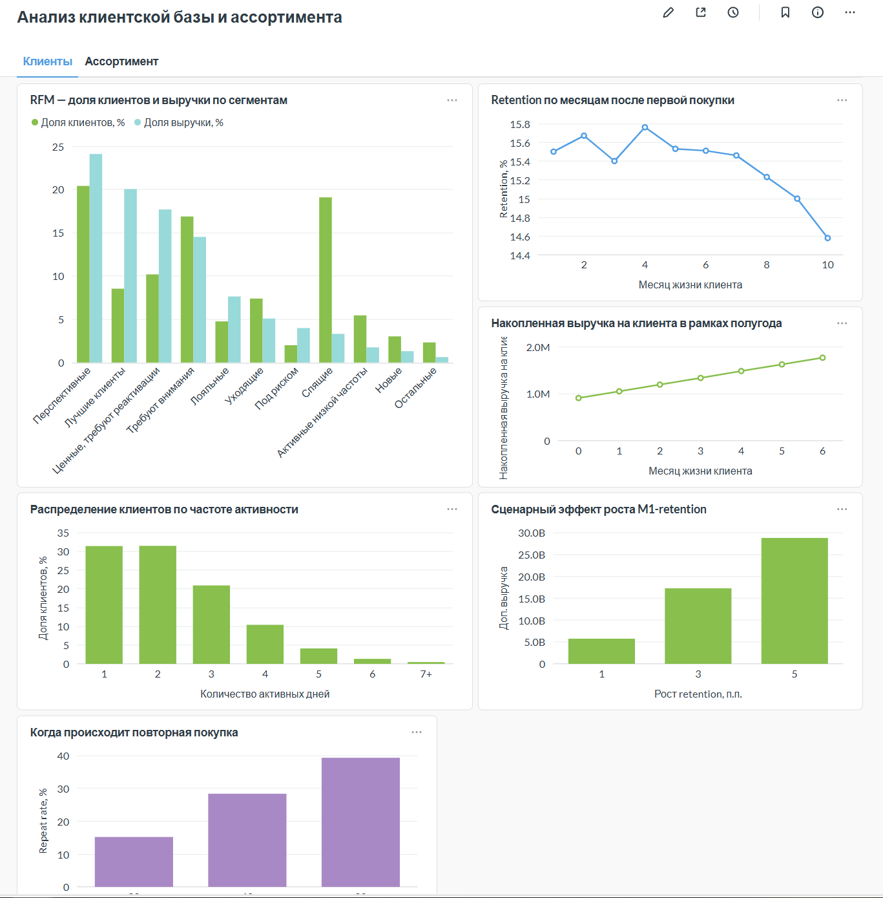

# Дашборды Metabase

## Навигация

| Дашборд | Содержание | Ссылка |
|---|---|---|
| Продажи — основные метрики | Общая сводка, ассортимент, активность и ценность клиентов | [Открыть Metabase](http://194.58.118.193:3000/dashboard/2-prodazhi-osnovnye-metrik?tab=6-%D0%BE%D0%B1%D1%89%D0%B0%D1%8F-%D1%81%D0%B2%D0%BE%D0%B4%D0%BA%D0%B0) |
| Анализ клиентской базы и ассортимента | RFM, retention, LTV, сценарии и ABC/XYZ | [Открыть Metabase](http://194.58.118.193:3000/dashboard/3-analiz-klientskoj-bazy-i-assortimenta?tab=9-%D0%BA%D0%BB%D0%B8%D0%B5%D0%BD%D1%82%D1%8B) |

[Общая сводка](images/sales-overview.png) и [анализ ассортимента](images/assortment-analysis.png) встроены в основной README. Здесь представлен клиентский блок.

## Клиентская аналитика

На снимке показаны:

- **RFM:** сопоставление доли клиентов и доли выручки по сегментам.
- **Retention:** активность в месяцы после первой наблюдаемой покупки.
- **Накопленная выручка:** динамика показателя на клиента по месяцу жизни когорты.
- **Частота активности:** распределение по числу покупательских дней.
- **Сценарии M1-retention:** дополнительная выручка при условном росте удержания на 1, 3 и 5 процентных пунктов.

Нижний график repeat rate частично обрезан на исходном снимке: его подписи по оси X не видны. Его назначение — доля клиентов с повторной активностью за 30, 60 и 90 дней; расчёт доступен в [SQL](../sql/customers/13_repeat_rate.sql). Для презентации этого графика отдельно нужен полный снимок.

## Как читать показатели

RFM-частота означает покупательские дни, а не число заказов. Retention измеряет возвращение в отдельном месяце и не доказывает непрерывную активность одних и тех же людей. Узкий диапазон оси retention визуально усиливает небольшие колебания.

Выручечный LTV на рисунке содержит точки M0–M6, включая месяц первой наблюдаемой покупки. Это накопленная выручка, а не прибыль. Сценарий retention предполагает постоянную выручку на дополнительного активного клиента и не является прогнозом.

Обозначения интерфейса: k — тысячи, M — миллионы, B — миллиарды, T — триллионы. В денежных графиках используются рубли; количество единиц и клиентов показано отдельно.

Скриншоты отражают предоставленный результат работы, но не служат подтверждением текущего пересчёта запросов. В обзорной карточке число клиентов округлено примерно до 870 тыс.; ранее для исследовательской выборки фигурировало 864 460. Согласование фильтров обзорных карточек с исследовательским SQL требует отдельной проверки.

Подробнее: [методология и ограничения](methodology.md).

## Условия просмотра

Дашборды размещены в Metabase на VPS. Их доступность зависит от работы сервера и приложения. Предоставлены обычные адреса /dashboard/, а не публичные ссылки /public/dashboard/. Доступ к данным без входа не подтверждён; учётные данные не публикуются.

Скриншоты сохранены в GitHub и доступны читателю, имеющему доступ к репозиторию, даже при недоступном сервере. Репозиторий приватный.

Часть исследовательских карточек ранее создавалась на зафиксированных результатах через SQL VALUES. Такие карточки не пересчитываются при ежедневной загрузке продаж. Наличие ссылки на живой Metabase само по себе не означает автоматическое обновление всех показателей.
