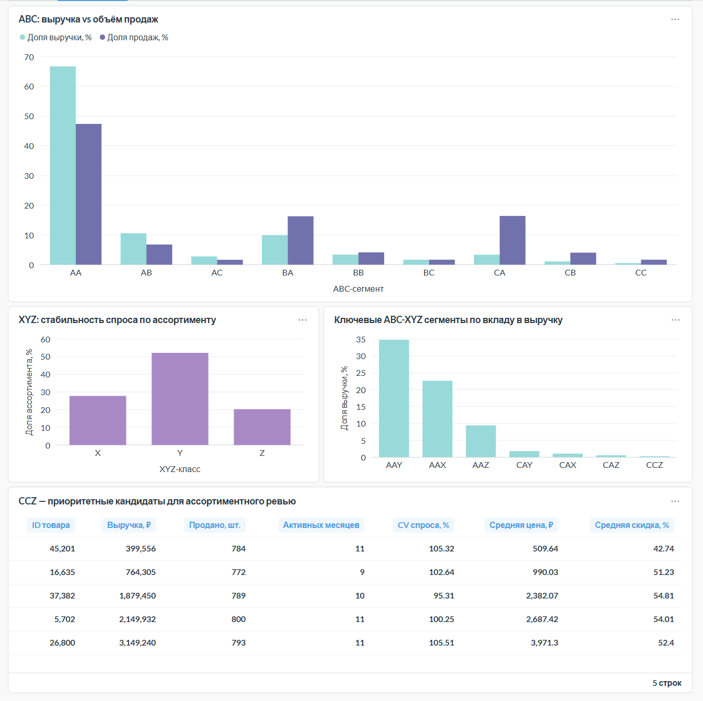
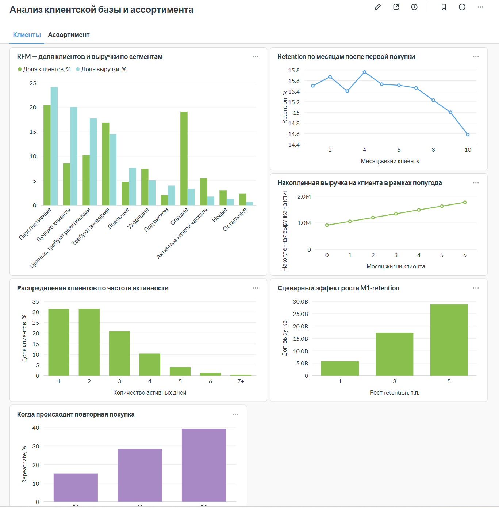
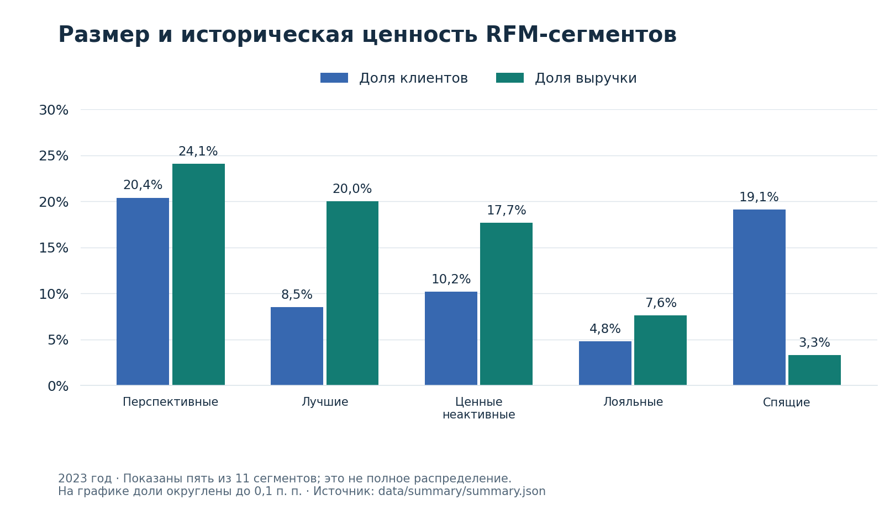

# Дашборды Metabase

## Навигация

| Дашборд | Содержание | Ссылка |
|---|---|---|
| Продажи — основные метрики | Общая сводка, ассортимент, активность и ценность клиентов | [Открыть Metabase](http://194.58.118.193:3000/public/dashboard/978dff62-493d-4fd6-bb8e-1ac864d4224c) |
| Анализ клиентской базы и ассортимента | RFM, retention, LTV, сценарии и ABC/XYZ | [Открыть Metabase](http://194.58.118.193:3000/public/dashboard/955746b0-6571-4fc7-b266-d2311d82217a) |

[Главная](../README.md) · [Исследование ассортимента](analysis/assortment.md) · [Исследование клиентов](analysis/customers.md)

## Продажи и ассортимент

Первая буква сегмента означает ABC по выручке, вторая — по проданным единицам, третья — XYZ. «Доля продаж» на снимке означает долю единиц. Для XYZ использованы пороги CV 55/75%. Пять CCZ-кандидатов на историческом снимке и новая группа действий из 184 SKU имеют разные правила; [пояснение](analysis/assortment.md#почему-в-существующем-sql-пять-кандидатов).

## Клиентская аналитика

На снимке показаны:

- **RFM:** сопоставление доли клиентов и доли выручки по сегментам.
- **Retention:** активность в месяцы после первой наблюдаемой покупки.
- **Накопленная выручка:** динамика показателя на клиента по месяцу жизни когорты.
- **Частота активности:** распределение по числу покупательских дней.
- **Сценарии M1-retention:** дополнительная выручка при условном росте удержания на 1, 3 и 5 процентных пунктов.

Нижний график repeat rate частично обрезан на исходном снимке: его подписи по оси X не видны. Полные самостоятельные графики ниже построены из [сохранённых агрегатов](../data/summary/README.md), без обращения к Metabase. Расчёт repeat rate доступен в [SQL](../sql/customers/13_repeat_rate.sql).

## Полные графики результатов

RFM-график содержит пять из 11 сегментов. Repeat rate использует разные допустимые выборки для каждого горизонта. Источник чисел — исторический снимок исследования; [скрипт](../scripts/build_summary_assets.py) повторно строит изображения и CSV из JSON, но не пересчитывает метрики на базе.

## Как читать показатели

RFM-частота означает покупательские дни, а не число заказов. Retention измеряет возвращение в отдельном месяце и не доказывает непрерывную активность одних и тех же людей. Узкий диапазон оси retention визуально усиливает небольшие колебания.

Выручечный LTV на рисунке содержит точки M0–M6, включая месяц первой наблюдаемой покупки. Это накопленная выручка, а не прибыль. Сценарий retention предполагает постоянную выручку на дополнительного активного клиента и не является прогнозом.

Обозначения интерфейса: k — тысячи, M — миллионы, B — миллиарды, T — триллионы. В денежных графиках используются рубли; количество единиц и клиентов показано отдельно.

Скриншоты отражают предоставленный результат работы, но не служат подтверждением текущего пересчёта запросов. В обзорной карточке число клиентов округлено примерно до 870 тыс.; ранее для исследовательской выборки фигурировало 864 460. Согласование фильтров обзорных карточек с исследовательским SQL требует отдельной проверки.

Подробнее: [методология и ограничения](methodology.md).

## Условия просмотра

Дашборды размещены в Metabase на VPS и доступны по публичным ссылкам `/public/dashboard/` без входа в аккаунт. Их доступность и скорость загрузки зависят от работы сервера и приложения. Учётные данные для просмотра не требуются.

Репозиторий публичный. Скриншоты сохранены в GitHub и доступны без авторизации, в том числе при недоступном сервере Metabase.

Часть исследовательских карточек ранее создавалась на зафиксированных результатах через SQL VALUES. Такие карточки не пересчитываются при ежедневной загрузке продаж. Наличие ссылки на живой Metabase само по себе не означает автоматическое обновление всех показателей.
